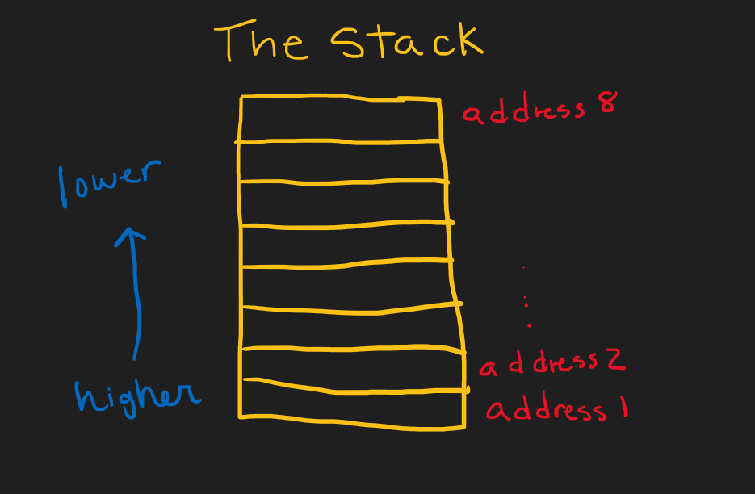
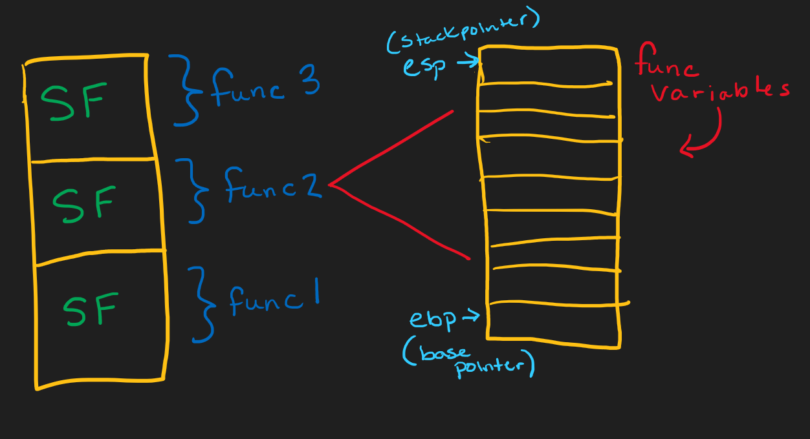
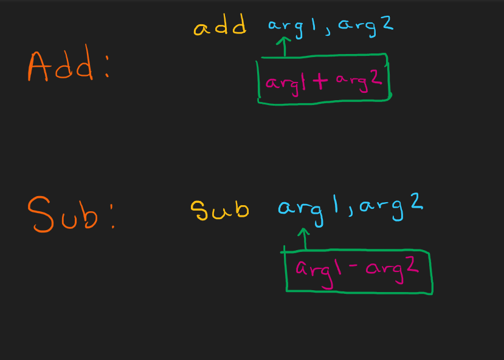
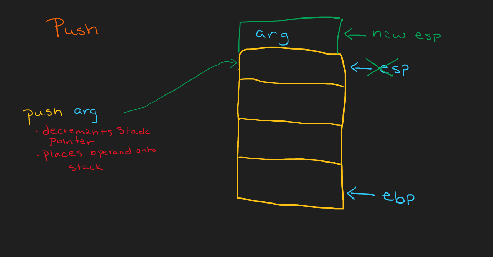
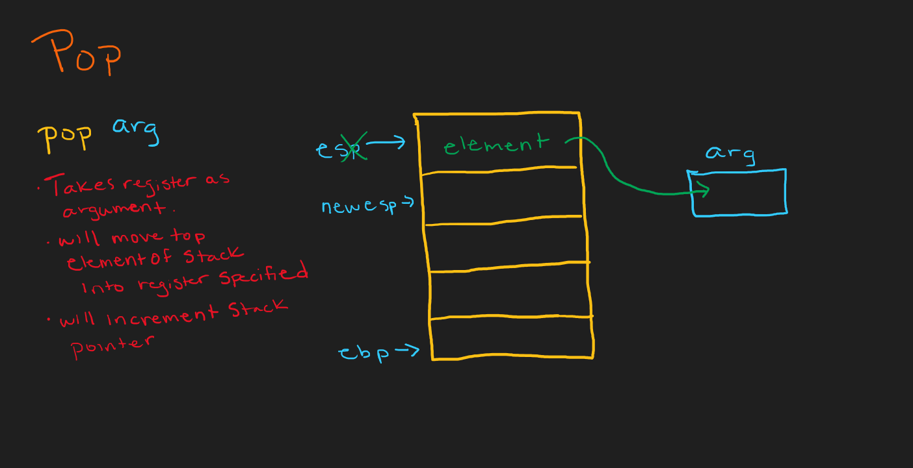
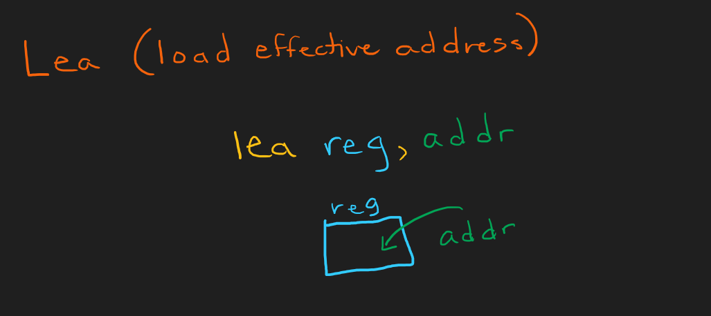
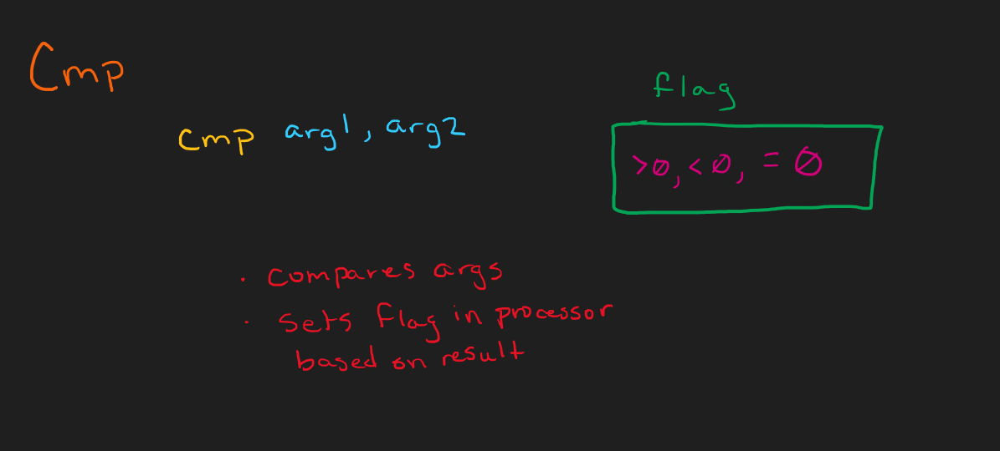
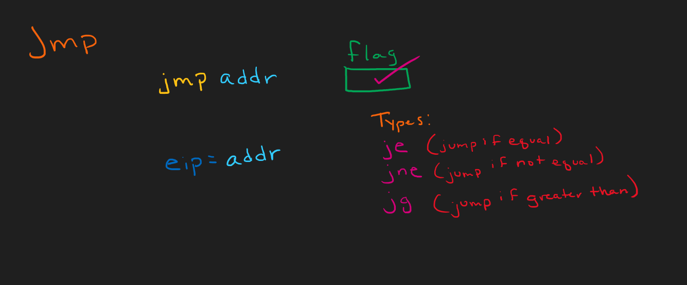
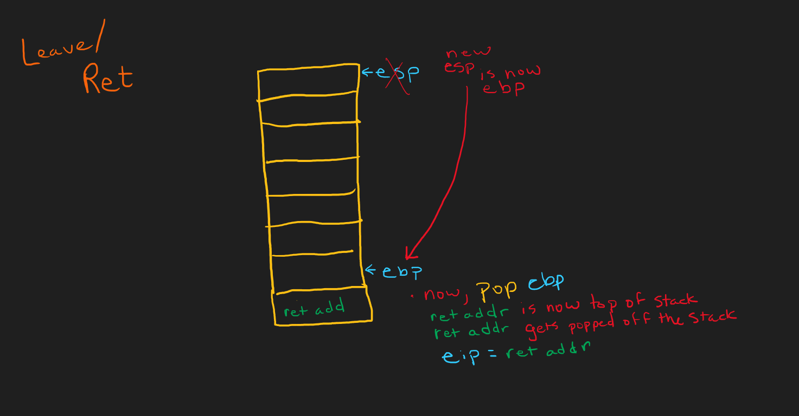

# Introduction to x86 Assembly

C programs are comprised of four main sections:
 - Heap
 - Stack
 - Registers
 - Instructions

The **heap** is an area in memory designed for manually memory allocation. 
malloc, calloc, global and static variables all go into the heap.

## Registers

Registers are small storage areas in your processor.
Can be used to represent anything that is 8 bytes or less.

### x86 Registers

There are six general purpose registers.

**eax, ebx, ecx, edx, esi, edi**

These are used on an as-needed basis

There are 3 *reserved* registers:

**ebp, esp, eip**

## The stack

Items are added via **push** and **pop**.
This is a LIFO data structure.
The stack grows toward lower memory address.

Whenever a function is called, it is setup with a **stack frame**. 
All of the local variables will be stored in that functions stack frame.

All of the memory between the base pointer and the stack pointer is the stack frame.

Values on the stack cannot be moved directly. To move a value, it is copied into a general purpose register.

## Assembly (Intel)

Every instruction has two parts: the **operation** and its **arguments**.
Operations can take either one or two arguments.

Lets look at the operations:

The **mov** operation moves values around the stack. It accepts two arguments:

The **add** and **sub** operations are similar. They accept two arguments:

The **push** instruction accepts a single argument. It pushes the arguement onto the stack, decrementing the stack pointer.

The **pop** instruction accepts a register as a single argument. It increments the stack pointer and pops the value off of the stack, inserting the value into the specified register.

The **lea** instruction places the address specified by the second argument into the register of its first argument

The **cmp** instruction is similar to the sub instruction, expect instead of storing the result, it will set a flag in the processor (less than 0, 0, greater than 0)

The **jmp** instruction always follows cmp. It will set the eip (extended instruction pointer) to the addressed passed to it if the flag condition is met.

The **call** instruction calls a function. It takes one arguement. It is equivalent to push eip, jmp argument.

The leave function and the **ret** are called at the end of every function. They destroy the current stack frame by setting stack pointer to the base pointer and pop the base pointer off of the stack, setting eip to the ret address.

---

Source : "HackUCF: YouTube: x86 Assembly Crash Course: https://youtube.com/watch?v=75gBFiFtAb8

